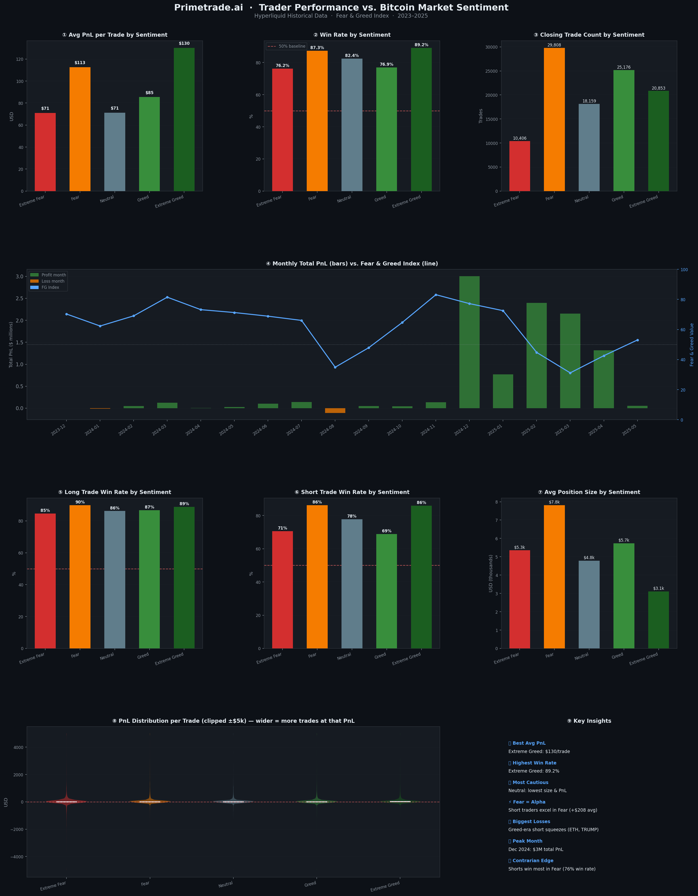

# 📊 Bitcoin Market Sentiment × Trader Performance Analysis

> **Primetrade.ai Data Analysis Assignment**  
> Exploring how Bitcoin's Fear & Greed Index drives trader behaviour, win rates, and PnL on Hyperliquid — across 211,000+ real trades from 2023–2025.

---

## 🧠 Objective

Can market sentiment predict trading outcomes? This project merges two datasets to answer exactly that:

- **Bitcoin Fear & Greed Index** — daily sentiment score (0–100) with classification
- **Hyperliquid Historical Trader Data** — 211K+ real on-chain trades with PnL, direction, size, and account info

---

## 📁 Repository Structure

```
📦 primetrade-sentiment-analysis/
├── 📓 primetrade_sentiment_analysis.ipynb   ← Main analysis notebook
├── 📊 sentiment_analysis.png                ← Full dashboard visual
├── 📄 fear_greed_index.csv                  ← Dataset 1
├── 📄 historical_data.csv                   ← Dataset 2
└── 📄 README.md
```

---

## 🔍 Key Findings

### 1. 🏆 Extreme Greed = Highest Win Rate
Trades executed during **Extreme Greed** days had the highest win rate at **89.2%** and the highest average PnL at **$130/trade**. Momentum long strategies dominate during euphoric markets.

### 2. ⚡ Fear is a Short Trader's Paradise
Short positions during **Fear** periods averaged **$208 PnL/trade** — the highest of any sentiment-direction combination. When the market is falling, shorts catch the move cleanly.

### 3. 🔴 Greed Phases Create Short Squeeze Risk
The single largest losses in the dataset all occurred on **short positions during Greed** phases:
- ETH short: **-$117,990** (Dec 2024, Greed)
- TRUMP short: **-$83,056** (Apr 2025, Greed)

Counter-trend shorts get punished heavily when sentiment is euphoric.

### 4. 📅 December 2024 = Peak Performance Month
**$3M+ total PnL** in a single month, coinciding with peak Greed index values and HYPE token dominance.

### 5. 📐 Position Sizing Inversely Tracks Extreme Sentiment
Traders placed their **largest positions during Fear** ($7,816 avg) and **smallest during Extreme Greed** ($3,112 avg) — suggesting experienced traders de-risk after big gains and aggressively buy dips.

---

## 📈 Performance Summary Table

| Sentiment | Avg PnL/Trade | Win Rate | Avg Position Size | Best Strategy |
|-----------|:------------:|:--------:|:-----------------:|:-------------:|
| Extreme Fear | $71 | 76.2% | $5,350 | Cautious longs |
| Fear | $113 | 87.3% | $7,816 | Short positions |
| Neutral | $71 | 82.4% | $4,783 | Balanced |
| Greed | $85 | 76.9% | $5,737 | Long momentum |
| Extreme Greed | $130 | 89.2% | $3,112 | Long momentum, reduce size |

---

## 📊 Dashboard Preview



---

## 🛠️ Tech Stack

| Tool | Purpose |
|------|---------|
| `Python 3.11` | Core language |
| `Pandas` | Data manipulation & merging |
| `NumPy` | Numerical operations |
| `Matplotlib` | Chart generation |
| `Seaborn` | Statistical visualisations |
| `Jupyter Notebook` | Analysis environment |

---

## 🚀 How to Run

```bash
# 1. Clone the repo
git clone https://github.com/YOUR_USERNAME/primetrade-sentiment-analysis
cd primetrade-sentiment-analysis

# 2. Install dependencies
pip install pandas numpy matplotlib seaborn jupyter

# 3. Launch the notebook
jupyter notebook primetrade_sentiment_analysis.ipynb
```

> Make sure `fear_greed_index.csv` and `historical_data.csv` are in the same folder as the notebook.

---

## 💡 Strategy Recommendations

Based on the analysis, a sentiment-aware trading strategy would:

1. **During Greed** → Ride long momentum on BTC, ETH, HYPE. Avoid counter-trend shorts.
2. **During Fear** → Short selectively with defined risk. Highest reward-to-risk ratio.
3. **During Extreme Greed** → Reduce position sizes, take partial profits.
4. **During Extreme Fear** → Watch for reversal signals before entering longs.
5. **Universal** → Never run large short positions during Greed phases. The squeeze risk is statistically significant.

---

## 👤 Author

**Hasitha Priya K**  
B.E. Electronics & Communication Engineering  
CMR Institute of Technology, Bengaluru  
📧 [hasikarnam27@gmail.com] &nbsp;|&nbsp; 🔗 [LinkedIn](https://www.linkedin.com/in/hasitha-priya-k-114513333/) &nbsp;|&nbsp; 💻 [GitHub](https://github.com/hasitha165616-pixel)

---

*Submitted as part of the Primetrade.ai AI/Data Internship hiring process.*